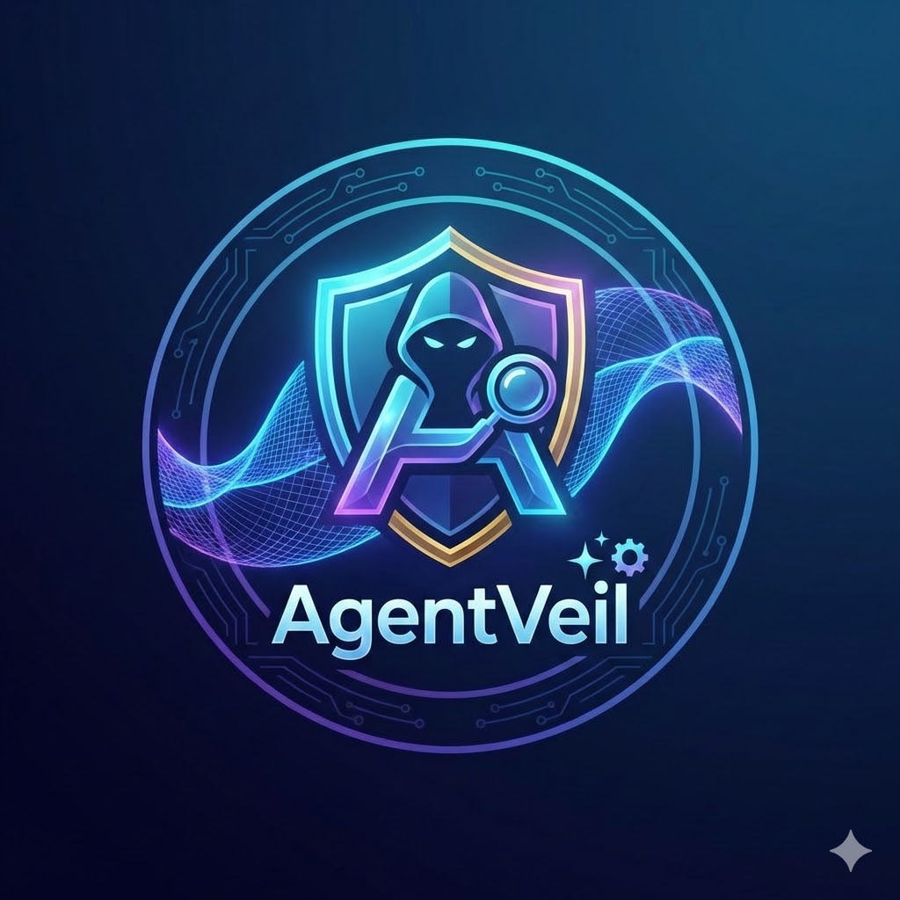

#  AgentVeil

**Automated AI Security & UX Auditing Pipeline**

AgentVeil is a next-generation, autonomous security and user experience (UX) auditing platform. It bridges the gap between static code analysis and dynamic testing by deploying multiple specialized AI agents to crawl, analyze, and automatically fix vulnerabilities in web applications in real-time.

---

## 🏗️ Core Architecture & Tech Stack

AgentVeil is built on a modern, highly concurrent, and cloud-native stack designed for speed and reliability.

### The Frontend Dashboard
*   **Next.js (React 18)**: The core framework for the dashboard, providing seamless Server-Side Rendering (SSR) and API routes.
*   **Tailwind CSS**: Used for rapid, responsive, and beautiful styling of the dashboard interface.
*   **TypeScript**: Ensures type safety across the frontend and API proxy routes.

### The Backend Databases & APIs
*   **Convex**: The primary database and real-time synchronization engine. Convex allows the dashboard to instantly reflect new vulnerabilities found by the agents without manual polling. It seamlessly bridges the AI backend with the React frontend.
*   **FastAPI / Uvicorn (Python)**: The backbone of the agent APIs. Both the Logic Agent, UI Agent, and Fixer services run as robust Python FastAPI microservices, providing endpoints for triggering scans and generating pull requests.

### AI Models & Tooling
*   **MiniMax API (`minimax-text-01`)**: The core Large Language Model used by the *Fixer Agent*. MiniMax provides lightning-fast inference capabilities, allowing AgentVeil to analyze broken code snippets and output complete, corrected files instantly.
*   **Browser Use**: The driving force behind the *UI Agent*. Browser Use allows an AI agent to spin up a headless Chromium instance, physically navigate through the target website like a human user, and visually inspect rendering issues, broken links, or UX flaws.
*   **Gemini 2.0 Flash / OpenAI (Python)**: Used for rapid classification, reasoning, and generating prompts during the logic scanning phases.

---

## 🤖 The Three-Agent System

AgentVeil utilizes a multi-agent orchestrated approach, dividing the massive task of application auditing into three distinct, specialized workers:

### 1. The Logic Agent 🧠 (Vulnerability & Security Scanner)
The Logic Agent focuses on the invisible threats:
*   **Static Code Analysis**: It reviews the GitHub repository structure to understand the application routing and architecture.
*   **Dynamic Endpoint Testing**: It actively probes the target URL for common vulnerabilities like SQL Injection, Broken Access Control, and SSRF (Server-Side Request Forgery).
*   **Real-time Streaming**: Discovered breaches are streamed in raw time via Server-Sent Events (SSE) directly to the Next.js dashboard, providing instant feedback.

### 2. The UI / UX Agent 🎨 (Visual Inspector)
The UI Agent focuses on what the user actually sees:
*   **Headless Navigation (`browser-use`)**: It spins up a browser and actively clicks through the application, looking for layout shifts, missing images, unhandled 404s, or poor accessibility (a11y) practices.
*   **Console Monitoring**: It monitors the browser console for silent JavaScript errors and network failures that might degrade the user experience.
*   **Concurrent Execution**: The UI Agent runs in parallel with the Logic Agent, allowing a full-stack audit to occur in half the time.

### 3. The Fixer Agent 🛠️ (Automated Remediation)
AgentVeil doesn't just find problems; it fixes them.
*   **Contextual Patching**: When an error is found, the Fixer reads the exact GitHub file related to that route.
*   **MiniMax LLM Generation**: It sends the error logs and the full file content to the `minimax-text-01` model, requesting a fully repaired, correct file.
*   **Automated Pull Requests (PRs)**: The Fixer uses the GitHub API to automatically create a new branch containing the fix, and opens a Pull Request directly against the user's repository, complete with a detailed summary.

---

## 📚 Design Philosophy & Inspiration
AgentVeil core methodology—utilizing a generative agent to model adversarial user behaviors alongside a separate discriminator to systematically expose UI/UX vulnerabilities—is directly inspired by recent advances in Generative Adversarial Networks (GANs) adapted for web-element evaluation.

As highlighted in recent research (e.g., *"The Web User is Not Always Right: Measuring Quality-of-Experience in Generative Navigation Variants."* / arxiv.org/abs/2411.18279), simple rule-based testing is no longer sufficient. Modern web applications do not just break under stress; they break contextually under unexpected, complex human-like navigation.

Some critical realities our platform addresses based on these industry patterns:
- Traditional vulnerability scanners only check **backend API flaws**, leaving UI edge-cases completely ignored in testing pipelines.
- Modern Large Language Models (LLMs) used as "Agents" frequently fail to understand **visual layout context**, requiring headless, adversarial "sandboxed" testing (like AgentVeil UI Agent) to catch true visual layout rendering breaks and unhandled React UX boundaries.
- **Automation stops where Fixing begins**. By adopting generative patching, AgentVeil doesn't just discover errors; it proactively integrates auto-completed solutions within your repo, bridging the automation gap.


## 💡 Key Concepts & Techniques
## 📚 Design Philosophy & Inspiration
AgentVeil's core methodology—combining generative exploration with systematic validation to expose web vulnerabilities—is fundamentally aligned with current academic perspectives. In particular, the philosophy parallels findings in recent research, notably extending contexts from [Arxiv 2411.18279](https://arxiv.org/abs/2411.18279).

As this research identifies through its benchmarking of generative navigational tools against harmfulness checks, simple rule-based testing boundaries are fundamentally insufficient. Today's web platforms rarely collapse under isolated logic endpoints; instead, vulnerabilities hide deep within contextually intricate, multi-step interface operations that emulate "adversarial human behaviors."

**Key Insights we address:**
1. **The 'Gen-Nav' Reality:** As demonstrated in adversarial studies, Large Language Models and browsing architectures often struggle with visual layout consistency or contextual "jailbreaking" when driven maliciously. AgentVeil directly uses a headless navigator (simulating realistic attacks) to sniff out these unhandled React UX boundaries natively.
2. **Dynamic UI Breaking points:** It's no longer just about SQL injection. Layout shifts, malicious state overwrites, and unhandled JS console behaviors effectively break 'Quality of Service'. Our Multi-Agent approach detects this dynamically.
3. **Closing the Loop:** Where most evaluation stops at bug detection, AgentVeil introduces generative fixing—automatically patching these adversarial break points as soon as it records their evidence.

---

*   **Repository Normalization**: The system automatically intelligently parses full GitHub URLs down to their `owner/repo` formats, ensuring the GitHub API can always find the correct files regardless of how the user inputs them.
*   **Dynamic Branch Slugification**: When creating PRs, the system automatically translates AI-generated error titles into valid, URL-safe branch names (e.g., stripping brackets and ampersands) to prevent GitHub `422` reference errors.
*   **Rate Limits and Concurrency**: The dashboard safely handles large numbers of concurrent Agent runs without crashing, gracefully queuing Fixer fixes to ensure API rate limits (like MiniMax constraints) are respected.
*   **Virtual Environment Isolation**: The Python agents use isolated `.venv` environments to prevent dependency conflicts between FastApi, Browser Use, and standard libraries.

---

## 🚀 Running the Project Locally

AgentVeil uses isolated virtual environments locally via a single run orchestrator. Because it merges APIs on 3 ports along with NextJS locally, it requires keys natively available during startup through a standard configuration format.

**1. Create your Environment Configs**
Since secrets belong locally, create `.env` & `.env.local` natively at the root directory of cloned data. 
```bash
touch .env
```

Open `.env` to input your API keys explicitly or you will run into runtime access failure events. Fill in API values related back to UI Agents + MiniMax logic generation:
```bash
# ----- .env 

BROWSER_USE_API_KEY="your_API_token_value"
MINIMAX_API_KEY="your_API_token_value"
MINIMAX_GROUP_ID="your_group_ID"

# Needed for automated fixes committing PRs directly to remote:
GITHUB_TOKEN="your_personal_access_token_with_repo_scope"
```

**2. Synchronize Convex Backend Settings**
Because AgentVeil broadcasts discovered web data concurrently via React components, you also need to generate your `Convex_deployment` instances securely.
```bash
npx convex dev
```
*Note: Doing this command will prompt your convex setup natively, and intelligently output a `.env.local` file hosting `CONVEX_DEPLOYMENT` and `NEXT_PUBLIC_CONVEX_URL` so Next.js syncs locally to convex! Leave this terminal instance alone (running).*

**3. Start the AgentVeil Cluster**
In a new terminal, launch the interactive pipeline Bash script! This spins up the React frontend and all 3 Python microservice `.venv` APIs properly on the correct ports natively.
```bash
sh start_local.sh
```

**4. Analyze!**
The script will automatically open your default browser to `http://localhost:3000`. Enter your target Website URL and its associated GitHub Repository, then click **Analyze** to watch the agents get to work!

*(To instantly detach and gracefully stop the full cluster, press `Ctrl+C` once in your terminal.)*

---

### References & Foundational Research
- Yang, R. et al., (2025). *"The Web User is Not Always Right: Measuring Quality-of-Experience in Generative Navigation Variants."* Available at: [arxiv.org/abs/2411.18279](https://arxiv.org/abs/2411.18279). *AgentVeil’s GAN-structured implementation relies on insights documented here scaling edge-path automation logic!* 
  
---

## 📚 Inspiration & Academic Alignment

AgentVeil's multi-modal framework acts as a bridge responding directly to challenges benchmarked in modern autonomous security studies, natively addressing paradigms outlined in:

- ["The Web User is Not Always Right: Measuring Quality-of-Experience in Generative Navigation Variants"](https://arxiv.org/abs/2411.18279) (Yang, R. et al., 2024).

This research fundamentally reveals that standard web testing heuristics fall short simply because **modern websites break contextually**, under irregular structural usage rather than load stresses alone. Where conventional testing tests isolated backend protocols natively, our tool embodies evaluating *Adversarial Generative Navigations* natively via front-end boundaries—making certain AI isn't simply detecting vulnerabilities—but natively understanding and resolving them layout by layout.

